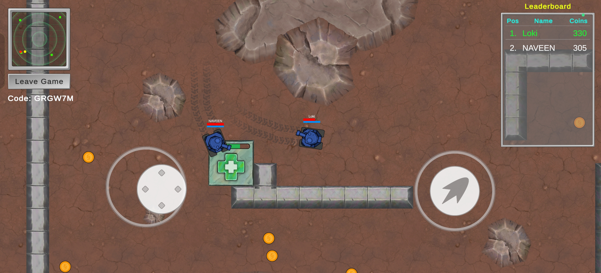
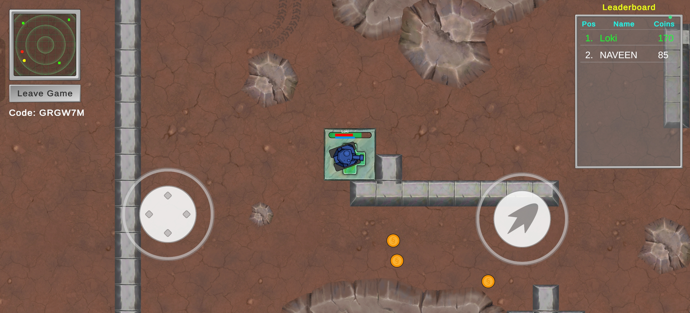
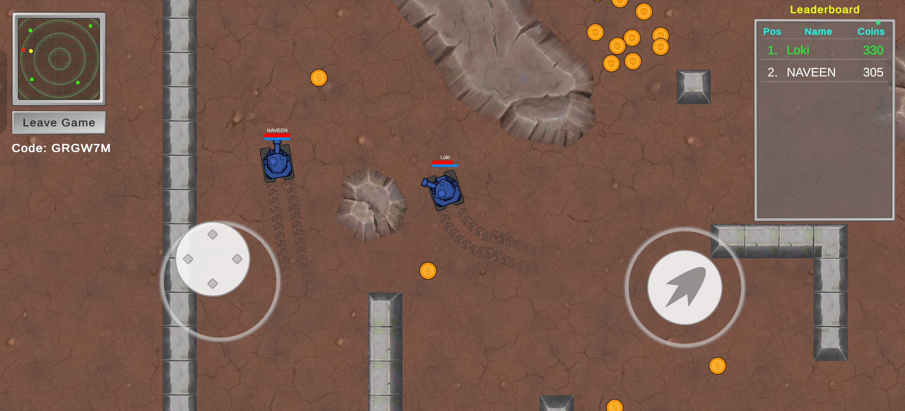
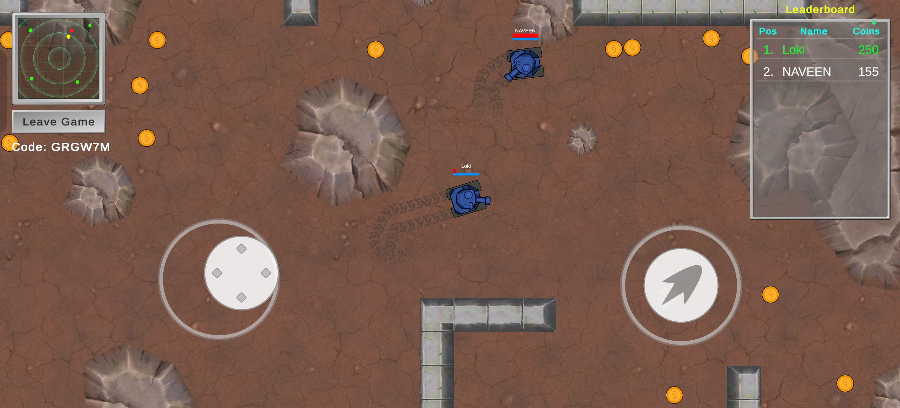
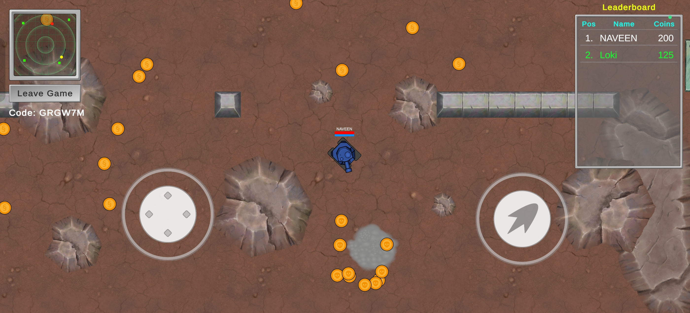

# 🎮 TANK BATTLE

<i>A Top Down 2D multiplayer tank battle game.</i>

---

## 🕹️ About the Game

**TANK BATTLE** is a **Top down, Action, Multiplayer** game developed using **Unity**.  

This project was developed with the help of an Udemy Course for multiplayer game development using Unity Netcode for gameobjects.

**Why this project?**
- To practice real-world multiplayer game development workflows
- To explore **Unity's Netcode**

---

## ✨ Key Features

- 🔥 Online multiplayer with Lobby system.
- 🎯 Real-time leaderboard for competetive gaming.

---

## 🧠 Special Concepts Implemented

### 🧩 Concept 1: Relay and Lobby
Used unity's Relay and Lobby service to make the game playable through online and with Lobby system so anyone can join any game.

---

## 🛠️ Tech Stack

| Category | Technology |
|--------|------------|
| Engine | Unity 2022 / Unity 6 |
| Language | C# |
| Tools | GitHub |
| Network | Unity Netcode |

---

## 🎮 Controls
<table>
<tr>
<td width="100%" valign="top">
    
#For PC:
| Action | Input |
|:------:|:------:|
| Move | WASD |
| Aim | Mouse move |
| Shoot | Left click |

</td>
<td width="10%"></td>
<td width="100%" valign="top">

#For Mobile:
| Action | Input |
|:------:|:------:|
| Move | Left Stick |
| Aim | Right Stick |
| Shoot | Right Stick leave |

</td>
</tr>
</table>

---

## 📸 Screenshots & GIFs

### Gameplay

  
  

  
  

  

---

## 🎥 Gameplay Video

👉 Yet to be uploaded

---
